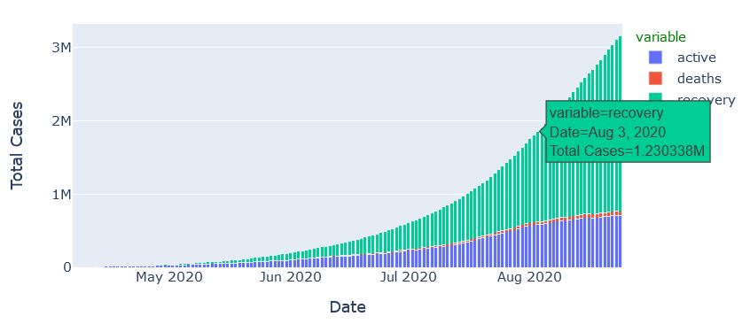
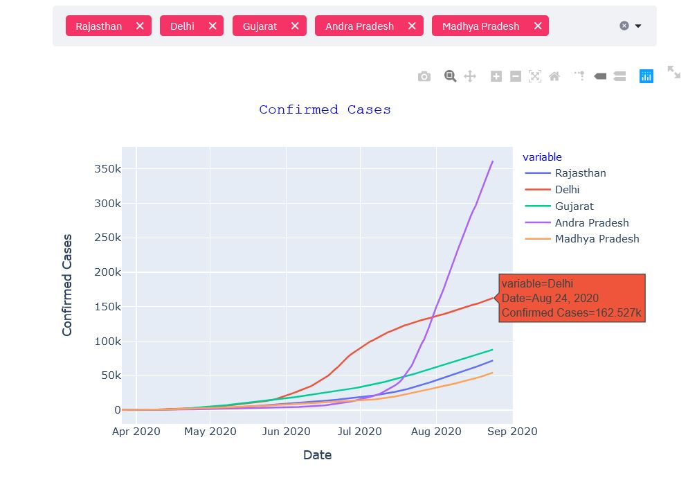
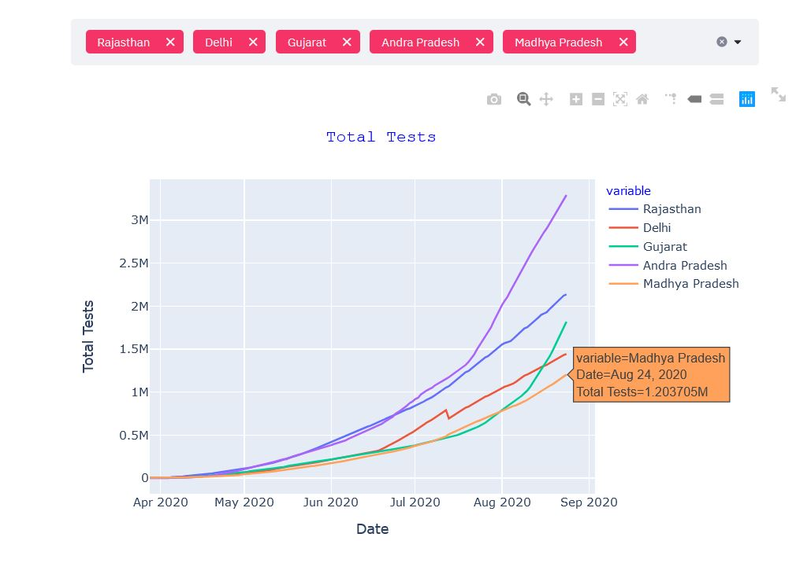

# Covid dashboard
[Covid Dashboard for India using Python Programming](https://covid--dashboard-india.herokuapp.com/)

It is a Dashboard that visualizes and helps to analyze the covid situation in India. Trends for virus affected cases 
are traced right from its first case on 30th July, 2020 till date. Data is updated daily and the trends are 
visualized accordingly. Data can be analysed and visualized statewise also. 

### Dashboard trace down -
1. Total Cases
2. Recovered Cases
3. Deaths 
4. Active Cases
5. Total Tests

Data is fetched as a json file using an api from official Indian Goverment Health Department website. Data is fetched, 
cleaned and prepared for the visualization. This is the only time consuming part in whole project.

```
resp = requests.get('https://api.covid19india.org/v4/timeseries.json')
df = pd.DataFrame(resp.json())
```

### Stacked bar chart showing covid timeline 


### Confirmed cases chart for selected States


### Total Tests graph for selected States

